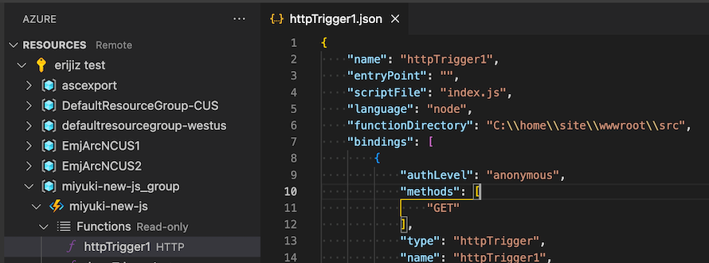

NOTES:

This branch is to test the latest worker in Azure before it rolls out.

1. Create a new Node 18 app like normal
1. Make sure to add these app settings:
    - `languageWorkers__node__workerDirectory` set to `D:\home\site\wwwroot\worker`
    - `AzureWebJobsFeatureFlags` set to `EnableWorkerIndexing`
1. Deploy this branch
1. At this point, you can verify if it worked by clicking the function in VS Code. It should have an actual scriptFile ("index.js") instead of the value "n/a"
    
1. If it didn't work, try a combination of restarting the app, redeploying the app from VS Code, and/or waiting a few minutes. I honestly don't know why it doesn't work immediately

---

# Azure Functions Node.js Framework v4 - Sample App

This repository contains a sample app for the [new Node.js framework for Azure Functions](https://aka.ms/AzFuncNodeV4). The default "main" branch uses TypeScript, but you may switch to the "main-js" branch for the same app using just JavaScript.

## Prerequisites

- Node.js v18+
- Azure Functions Host v4.14+
- Azure Functions Core Tools v4.0.4915+ (if running locally)
- Extension bundle v3.15+ (if using non-http triggers)

## Setup

1. Clone this repository
1. Add a `local.settings.json` file with the following contents:

    ```json
    {
        "IsEncrypted": false,
        "Values": {
            "FUNCTIONS_WORKER_RUNTIME": "node",
            "AzureWebJobsFeatureFlags": "EnableWorkerIndexing",
            "AzureWebJobsStorage": ""
        }
    }
    ```

1. Run `npm install`
1. Run `npm start`
1. Voila ✨ you have a running function app!

### Steps to enable more Azure triggers

The default configuration in this repository only enables an http and timer trigger. Follow these steps to enable more functions:

1. Change the `main` field in your `package.json` to `dist/src/functions/*.js`
1. Add a `local.settings.json` file with the following contents:

    ```json
    {
        "IsEncrypted": false,
        "Values": {
            "FUNCTIONS_WORKER_RUNTIME": "node",
            "AzureWebJobsFeatureFlags": "EnableWorkerIndexing",
            "AzureWebJobsStorage": "",
            "storage_APPSETTING": "",
            "cosmosDB_APPSETTING": "",
            "serviceBus_APPSETTING": "",
            "eventHub_APPSETTING": ""
        }
    }
    ```

1. Fill in the value for a connection string in your `local.settings.json` for the specific type of resource you want to try out. You can skip any resource you do not want to use
1. Run `npm start`!
1. If you trigger the `helloWorldWithExtraOutputs` function, it will set an output binding which triggers the other azure resource functions

## More details

See here for more information: https://aka.ms/AzFuncNodeV4